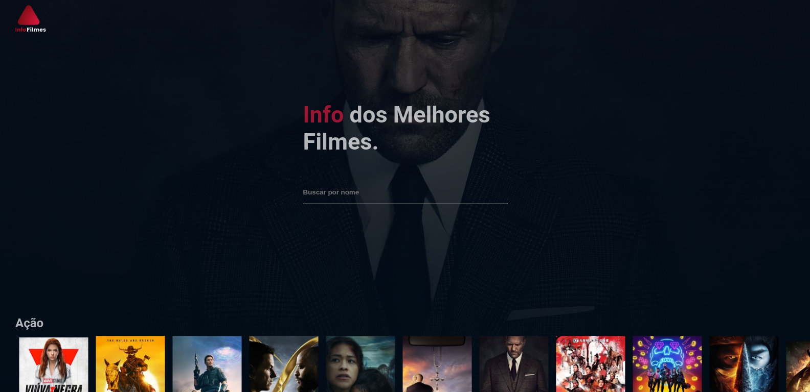

## 💻 Sobre o projeto

InfoFilmes foi desenvolvido com o objetivo
de pesquisar, ver descrições e trailer dos seus filmes favoritos.

Os usuários terão acesso Desktop e Mobile, onde poderão:

- Pesquisar filmes e documentários.
- Ver descrições do filme.
- Ver trailer do filme.

## 🎨 Layout

### Mobile


### Desktop


🛠 Tecnologias

As seguintes ferramentas foram usadas na construção do projeto:

- React Js
- Context API
- React Router
- API Tmdb

## 🚀 Como executar o projeto

### Pré-requisitos

Antes de começar, você vai precisar ter o [Git](https://git-scm.com) instalado em sua máquina.
Além disto é bom ter um editor para trabalhar com o código como [VSCode](https://code.visualstudio.com/).

### 🧭 Rodando a aplicação

```bash
# Clone este repositório
$ git clone git@github.com:tfeliperibeiro/movie-teste-estagio.git

# Acesse a pasta do projeto no seu terminal/cmd
$ cd movie-teste-estagio

# Instale as dependências
$ npm install

# Execute a aplicação em modo de desenvolvimento
$ npm start

# A aplicação será aberta na porta:3000 - acesse http://localhost:3000
```

Feito com ❤️ por Thiago Felipe
